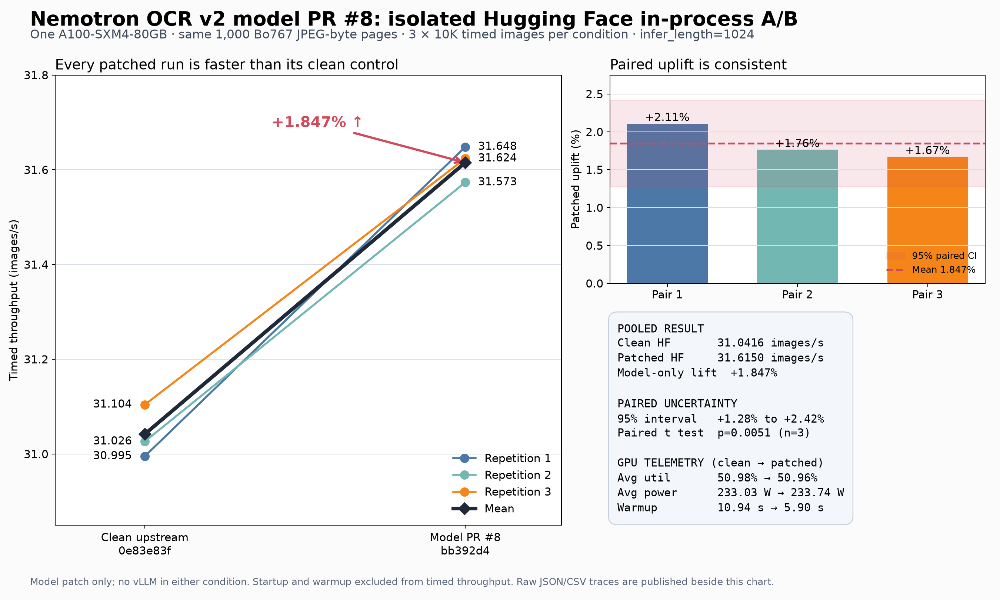
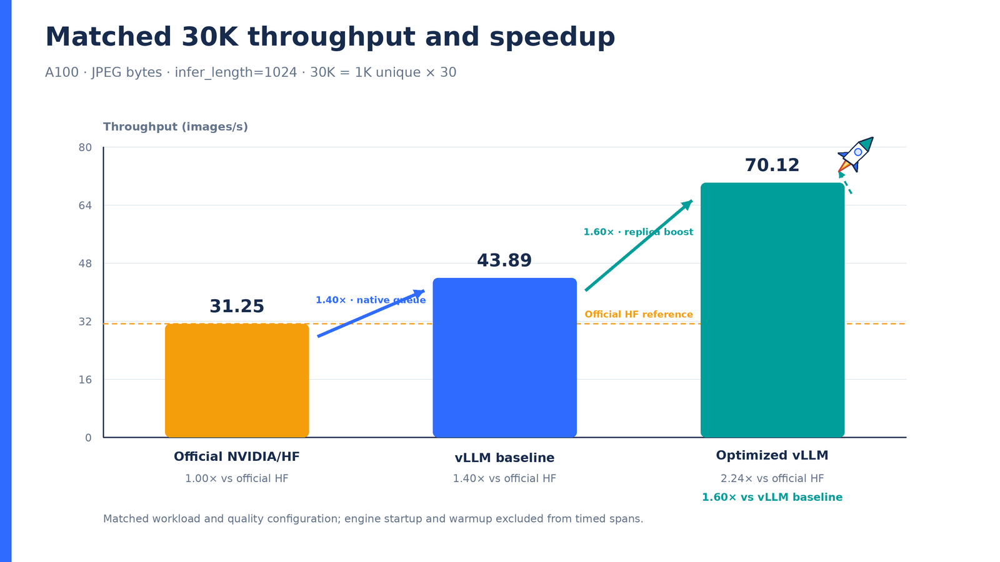
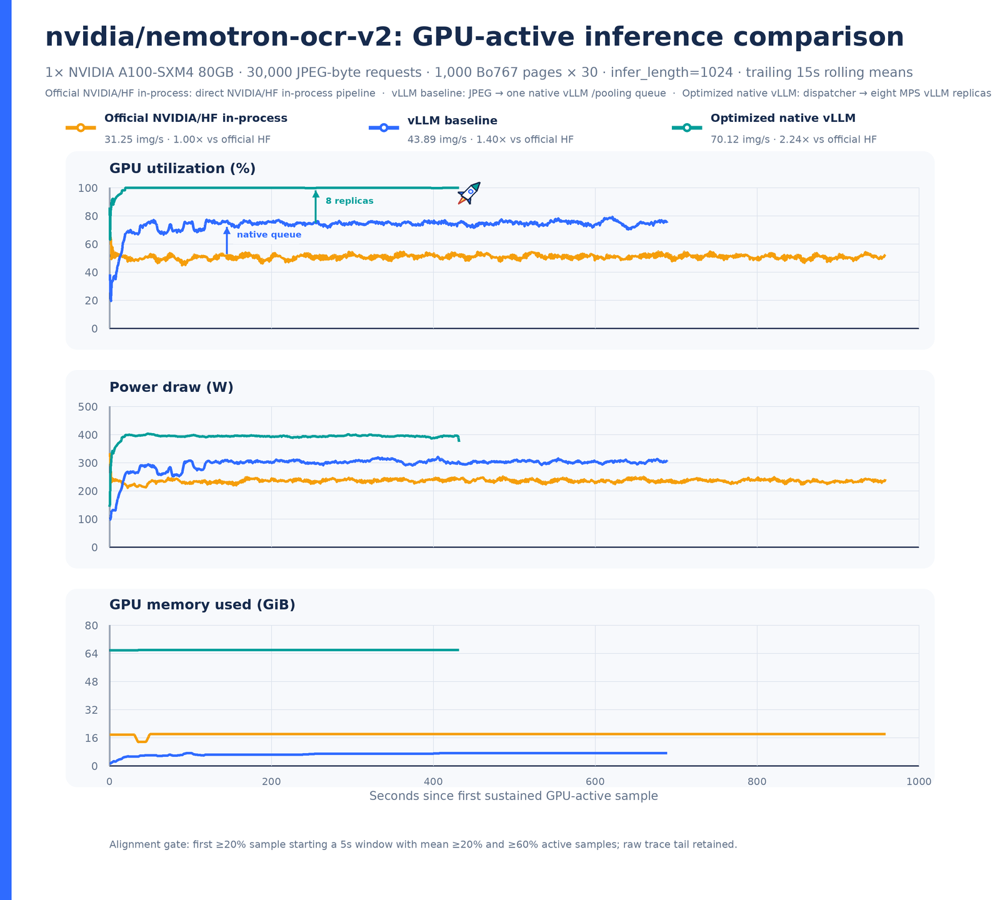
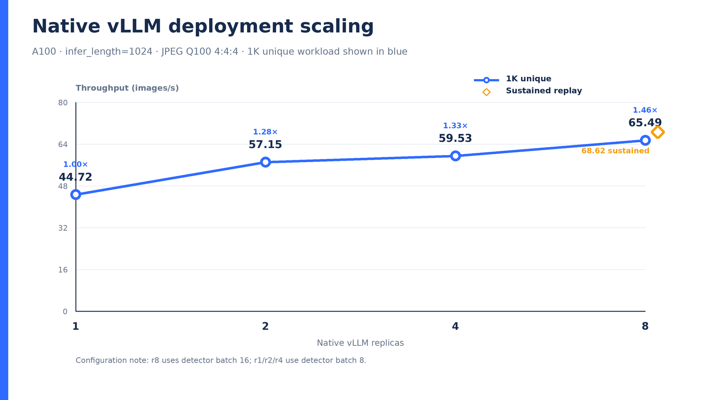
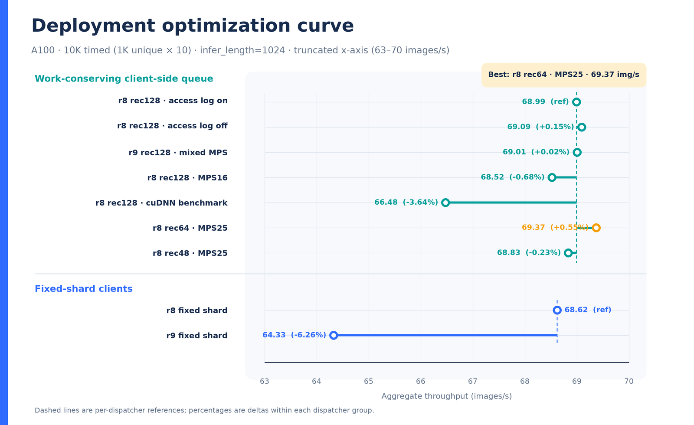

# Nemotron OCR v2 A100 throughput study

This page records a workload-specific optimization study for
[`nvidia/nemotron-ocr-v2`](https://huggingface.co/nvidia/nemotron-ocr-v2) on one
NVIDIA A100-SXM4-80GB. The optimized native vLLM deployment processed the
matched 30,000-image workload at **70.1156 images/s**: **2.24x** the official
NVIDIA/Hugging Face in-process pipeline and **1.60x** an isolated, single-replica
vLLM plugin baseline.

!!! warning "The rec64 profile is throughput-tuned, not accuracy-validated"

    The 70.1156 images/s result uses recognizer chunk 64. Its OCR quality impact
    remains unresolved because the evaluation has no labeled ground truth and
    repeated same-configuration runs are not bitwise stable. Recognizer chunk
    128 reached 69.5380 images/s and remains the conservative accuracy profile.
    Do not describe rec64 as accuracy-preserving without a labeled evaluation.

## Isolated model-patch contribution

The external model changes were also tested without vLLM to separate their
direct effect from the deployment-level queueing and replica gains. Three
isolated 10,000-image Hugging Face in-process repetitions were run per
condition on the same A100, with identical input order and OCR settings.

Clean upstream pooled at **31.0416 images/s** and model PR #8 pooled at
**31.6150 images/s**, a **1.847% model-only uplift**. All three paired runs
were positive (+2.11%, +1.76%, and +1.67%); the paired 95% small-sample
interval was +1.28% to +2.42%.



[Vector version](../assets/benchmarking/nemotron_ocr_v2_a100/model_pr8_hf_ab.svg) ·
[raw results, GPU traces, statistics, and protocol](https://github.com/VibhuJawa/nemotron-vllm-ocr/tree/main/results/a100-2026-07-09-model-pr8-ab)

This is the speedup attributable to the model patch under direct Hugging Face
execution. The 2.24x result below is the complete optimized serving stack and
must not be attributed to the model PR alone.

## Matched 30K result



[Vector version](../assets/benchmarking/nemotron_ocr_v2_a100/matched_30k_speedup.svg)

| System | Completed | Throughput | Versus official HF | Versus vLLM baseline |
| --- | ---: | ---: | ---: | ---: |
| Official NVIDIA/HF in-process | 30,000 / 30,000 | 31.2456869 images/s | 1.00x | 0.71x |
| Isolated vLLM baseline, one replica | 30,000 / 30,000 | 43.8926865 images/s | 1.40x | 1.00x |
| Optimized native vLLM, eight replicas, rec64 | 30,000 / 30,000 | **70.1156127 images/s** | **2.24x** | **1.60x** |

All three runs completed with zero recorded failures. Engine initialization and
warmup were excluded from each timed span. The earlier 23.2688 images/s vLLM
measurement is intentionally excluded: two full baseline jobs overlapped for
98.6% of their timed spans. The replacement above ran in isolation.

## Matched workload contract

| Control | Recorded value |
| --- | --- |
| Hardware | One NVIDIA A100-SXM4-80GB, UUID `GPU-242d3c90-db9c-a49e-e2b9-ddb0b36f1ba3` |
| Corpus | The same ordered 1,000 document pages for every system |
| Encoding | JPEG quality 100, 4:4:4, carried as base64 JPEG bytes in JSONL |
| Timed workload | 1,000 unique pages x 30 replays = 30,000 images |
| OCR contract | Multilingual checkpoint, paragraph merge, `infer_length=1024` |
| Metric | Completed timed images divided by measured timed span |
| Telemetry | `nvidia-smi` at a target 250 ms interval around each complete timed run |
| Isolation | Systems run sequentially; no overlapping GPU workload is accepted |

The JSONL corpus is `bo767_1k_pooling_jpeg_q100_444.jsonl`, contains
642,407,686 compressed bytes, and has SHA-256
`139c96ef75a85da440350722a95d9eb3bd21dd4155d43f7281253f63c07eaa16`.
Base64 and JPEG decoding occur inside the timed processing path.

## GPU-active behavior



[Vector version](../assets/benchmarking/nemotron_ocr_v2_a100/gpu_active_comparison.svg)

The official pipeline leaves visible gaps between compute bursts. A single
vLLM queue raises utilization, and eight warmed queues keep the optimized run
near saturation. The optimized trace averaged 99.74% GPU utilization and
393.17 W, with 67,555 MiB peak observed memory.

For the chart, each raw trace is aligned independently at its first sustained
GPU-active point: the first sample at or above 20% whose following five-second
window averages at least 20% utilization and has at least 60% active samples.
Lines are sample-based trailing 15-second means; the raw trace tail is retained.

## Deployment profile

| Setting | Official HF | Isolated vLLM baseline | Optimized vLLM |
| --- | ---: | ---: | ---: |
| Execution shape | In-process batches | 1 `/pooling` replica | 8 `/pooling` replicas |
| Official model source | Clean | Clean | Externally patched |
| Batch / `max_num_seqs` | 64 | 64 | 64 per replica |
| Renderer workers | N/A | 1 | 4 per replica |
| Detector max batch | 32 | 8 | 16 |
| Recognizer chunk | 128 | 128 | 64 |
| Relational chunk | 128 | 128 | 128 |
| Client concurrency | N/A | 128 | 128 per replica, 1,024 total |
| Warmup | 128 images | 32 requests | 32 requests per replica |
| CUDA MPS share | N/A | Single process, no partition | 25% per replica |
| vLLM execution | N/A | eager, async scheduling off | eager, async scheduling off |

Requests were dispatched from one work-conserving client-side queue: the next
available endpoint pulled the next image. This avoids fixed-shard tail
imbalance while preserving a separate continuous-batching queue per replica.

### Architecture boundary

Stock vLLM pooling cannot pass arbitrary CUDA tensors between independently
queued model instances. The measured design therefore keeps the detector,
recognizer, relational model, and postprocessing pipeline intact inside every
replica. vLLM queues and continuous-batches within each `/pooling` engine, while
the work-conserving dispatcher balances complete image requests across engines.
A future detector-to-recognizer split would need same-process CUDA
streams/events or a custom CUDA IPC, NCCL, or NIXL transport; the stock pooling
API does not provide that tensor handoff.

### Recorded command shape

The dataset builder and two benchmark drivers are archived with this study:
[`build_pooling_dataset.py`](../../benchmarks/nemotron_ocr_v2/build_pooling_dataset.py),
[`benchmark_hf_inprocess.py`](../../benchmarks/nemotron_ocr_v2/benchmark_hf_inprocess.py)
and
[`benchmark_multi_endpoint_pooling.py`](../../benchmarks/nemotron_ocr_v2/benchmark_multi_endpoint_pooling.py).
The commands below use those repo-local paths and record the measured
configuration. The optimized model-source patch and extension rebuild remain a
separate prerequisite.

```bash
ROOT=/raid/vjawa/tmp/ocr_optimization
VLLM_REPO=$(pwd)
GPU_UUID=GPU-242d3c90-db9c-a49e-e2b9-ddb0b36f1ba3
DATASET="$ROOT/data/bo767_1k_pooling_jpeg_q100_444.jsonl"
CLEAN_MODEL="$ROOT/nemotron-ocr-v2-baseline"
OPT_MODEL="$ROOT/nemotron-ocr-v2"
HF_OVERRIDES_BASELINE='{"model_type":"nemotron_ocr_v2","architectures":["NemotronOCRV2ForImageToText"],"nemotron_ocr_model_subdir":"v2_multilingual","nemotron_ocr_merge_level":"paragraph","nemotron_ocr_detector_max_batch_size":8,"nemotron_ocr_recognizer_chunk_size":128,"nemotron_ocr_relational_chunk_size":128,"nemotron_ocr_verbose_post":false,"nemotron_ocr_infer_length":1024}'
HF_OVERRIDES_OPTIMIZED='{"model_type":"nemotron_ocr_v2","architectures":["NemotronOCRV2ForImageToText"],"nemotron_ocr_model_subdir":"v2_multilingual","nemotron_ocr_merge_level":"paragraph","nemotron_ocr_detector_max_batch_size":16,"nemotron_ocr_recognizer_chunk_size":64,"nemotron_ocr_relational_chunk_size":128,"nemotron_ocr_verbose_post":false,"nemotron_ocr_infer_length":1024}'
```

The exact JPEG-byte encoding recipe is also reproducible from the repository.
Reproducing the corpus itself still requires the original ordered document
images, and the resulting JSONL must match the recorded SHA-256:

```bash
"$ROOT/venv/bin/python" \
  "$VLLM_REPO/benchmarks/nemotron_ocr_v2/build_pooling_dataset.py" \
  --image-dir /path/to/document_images \
  --output "$DATASET" --limit 1000 \
  --payload-mode jpeg-bytes --jpeg-quality 100 --jpeg-subsampling 0 \
  --workers 8
sha256sum "$DATASET"
```

The official NVIDIA/HF reference ran directly in-process:

```bash
CUDA_VISIBLE_DEVICES="$GPU_UUID" \
NEMOTRON_OCR_SOURCE="$CLEAN_MODEL/nemotron-ocr/src" \
PYTHONPATH="$CLEAN_MODEL/nemotron-ocr/src" \
"$ROOT/venv/bin/python" \
  "$VLLM_REPO/benchmarks/nemotron_ocr_v2/benchmark_hf_inprocess.py" \
  --dataset-jsonl "$DATASET" \
  --model-repo "$CLEAN_MODEL" \
  --model-dir "$CLEAN_MODEL/v2_multilingual" \
  --limit 1000 --batch-size 64 --warmup 128 --replay-count 30 \
  --merge-level paragraph --infer-length 1024 \
  --detector-max-batch-size 32 \
  --recognizer-chunk-size 128 --relational-chunk-size 128 \
  --gpu-trace-device "$GPU_UUID" --gpu-trace-interval-ms 250 \
  --gpu-trace-csv /path/to/gpu_trace.csv \
  --output-json /path/to/result.json
```

The isolated vLLM baseline used one clean-source server. The full
`--hf-overrides` object set architecture `NemotronOCRV2ForImageToText`, model
subdirectory `v2_multilingual`, paragraph merge, detector 8, recognizer 128,
relational 128, verbose postprocessing off, and `infer_length=1024`.

```bash
CUDA_VISIBLE_DEVICES="$GPU_UUID" \
NEMOTRON_OCR_SOURCE="$CLEAN_MODEL/nemotron-ocr/src" \
PYTHONPATH="$VLLM_REPO:$CLEAN_MODEL/nemotron-ocr/src" \
PYTORCH_CUDA_ALLOC_CONF=expandable_segments:True \
"$ROOT/venv/bin/vllm" serve "$CLEAN_MODEL" \
  --runner pooling --skip-tokenizer-init \
  --io-processor-plugin nemotron_ocr_v2 \
  --max-num-seqs 64 --gpu-memory-utilization 0.85 \
  --mm-processor-cache-gb 0 --renderer-num-workers 1 \
  --enforce-eager --no-async-scheduling \
  --host 127.0.0.1 --port 8110 \
  --disable-uvicorn-access-log --disable-log-stats \
  --hf-overrides "$HF_OVERRIDES_BASELINE"
```

After that foreground server reports ready, run the client in a second
terminal:

```bash
"$ROOT/venv/bin/python" \
  "$VLLM_REPO/benchmarks/nemotron_ocr_v2/benchmark_multi_endpoint_pooling.py" \
  --endpoint http://127.0.0.1:8110 \
  --dataset "$DATASET" --model "$CLEAN_MODEL" \
  --num-prompts 30000 --replay-count 30 --infer-length 1024 \
  --concurrency-per-endpoint 128 --warmups-per-endpoint 32 \
  --gpu "$GPU_UUID" --trace-interval-ms 250 \
  --output-dir /path/to/baseline-result
```

For the optimized run, eight instances used ports 8071 through 8078 on the
same A100 under CUDA MPS. Each used `max_num_seqs=64`, four renderer workers,
detector 16, recognizer 64, relational 128, a 25% active-thread share, disabled
access logs, and the same vLLM eager/scheduling settings as the baseline. The
client command repeated `--endpoint` for all eight ports with 128 workers and
32 warmups per endpoint. The rec128 control changed only recognizer chunk 64 to
128.

For single-server tuning, the repo also includes
[`serve_sweep.json`](../../benchmarks/nemotron_ocr_v2/serve_sweep.json) and
[`bench_sweep.json`](../../benchmarks/nemotron_ocr_v2/bench_sweep.json) for
[`vllm bench sweep serve`](sweeps.md). This keeps admission and continuous
batching inside native `AsyncLLM` while sweeping `max_num_seqs`, renderer
workers, and client concurrency. The benchmark README contains a complete
`--dry-run` command.

With a CUDA MPS daemon already configured for the selected GPU, the recorded
server and client shape was:

```bash
mkdir -p /tmp/nemotron-ocr-r8-logs
for PORT in {8071..8078}; do
  CUDA_VISIBLE_DEVICES="$GPU_UUID" \
  CUDA_MPS_ACTIVE_THREAD_PERCENTAGE=25 \
  NEMOTRON_OCR_SOURCE="$OPT_MODEL/nemotron-ocr/src" \
  PYTHONPATH="$VLLM_REPO:$OPT_MODEL/nemotron-ocr/src" \
  PYTORCH_CUDA_ALLOC_CONF=expandable_segments:True \
  "$ROOT/venv/bin/vllm" serve "$OPT_MODEL" \
    --runner pooling --skip-tokenizer-init \
    --io-processor-plugin nemotron_ocr_v2 \
    --max-num-seqs 64 --gpu-memory-utilization 0.85 \
    --mm-processor-cache-gb 0 --renderer-num-workers 4 \
    --enforce-eager --no-async-scheduling \
    --host 127.0.0.1 --port "$PORT" \
    --disable-uvicorn-access-log --disable-log-stats \
    --hf-overrides "$HF_OVERRIDES_OPTIMIZED" \
    >"/tmp/nemotron-ocr-r8-logs/server-$PORT.log" 2>&1 &
done

for PORT in {8071..8078}; do
  until curl --fail --silent "http://127.0.0.1:$PORT/health" >/dev/null; do
    sleep 2
  done
done

"$ROOT/venv/bin/python" \
  "$VLLM_REPO/benchmarks/nemotron_ocr_v2/benchmark_multi_endpoint_pooling.py" \
  --endpoint http://127.0.0.1:8071 \
  --endpoint http://127.0.0.1:8072 \
  --endpoint http://127.0.0.1:8073 \
  --endpoint http://127.0.0.1:8074 \
  --endpoint http://127.0.0.1:8075 \
  --endpoint http://127.0.0.1:8076 \
  --endpoint http://127.0.0.1:8077 \
  --endpoint http://127.0.0.1:8078 \
  --dataset "$DATASET" --model "$OPT_MODEL" \
  --num-prompts 30000 --replay-count 30 --infer-length 1024 \
  --concurrency-per-endpoint 128 --warmups-per-endpoint 32 \
  --gpu "$GPU_UUID" --trace-interval-ms 250 \
  --output-dir /path/to/optimized-result
```

## Supporting scaling and tuning runs



[Vector version](../assets/benchmarking/nemotron_ocr_v2_a100/native_vllm_scaling.svg)

On the separate 1,000-unique-image JPEG workload, native serving rose from
44.72 images/s at one replica to 65.49 images/s at eight replicas. The
eight-replica point also increased detector batch from 8 to 16, so this is a
deployment scaling curve rather than a replica-only ablation.



[Vector version](../assets/benchmarking/nemotron_ocr_v2_a100/deployment_optimization_curve.svg)

The separate 10,000-image sustained tuning series peaked at 69.3688 images/s
for eight replicas, recognizer chunk 64, and MPS 25%. Work-conserving and
fixed-shard dispatchers are different groups; their values are not a controlled
dispatcher-only comparison. Neither supporting chart should be substituted for
the matched 30K headline.

## Quality boundary

The rec64 publication profile completed at 70.1156127 images/s. The otherwise
matched rec128 control completed at 69.5380422 images/s, 0.824% lower, and is
retained as the conservative accuracy profile.

Thirty-two-image diagnostics show ordinary run-to-run variation even at the
same configuration. Rec64 happened to have 96.774% positionally zipped text
agreement with one official-HF output run, versus 92.194% for one rec128 repeat,
but the official output is another stochastic model run, not labeled ground
truth. Region insertions or deletions also shift subsequent zipped pairs, and
all three comparisons against that official-HF output failed the strict check.
These diagnostics establish neither bitwise identity nor accuracy preservation.

## Source and reproducibility boundary

The vLLM work was based on branch `agent/nemotron-ocr-v2-port` at commit
`62c2813a5af52bb2d60b1a2ee47bbfcf91280b9f`. The official and vLLM baseline
used a clean model checkout at
`0e83e83f17943524b90afa6c0fd82ac2bc1a40ca`.

!!! warning "The optimized result is not reproducible from this vLLM tree alone"

    The optimized servers used an external Nemotron OCR source tree and a
    locally rebuilt CUDA extension. The
    [archived model patch](../../benchmarks/nemotron_ocr_v2/nemotron_ocr_model_optimizations.patch)
    launches custom kernels on PyTorch's current CUDA stream and removes several
    synchronization points. It is a benchmark artifact, not part of the vLLM
    package or an official Hugging Face model commit. Its SHA-256 is
    `4b4b0cdf512586e37f98be474ad3fbd3ba7ae81fe4fb9f08c398f08e4f974db6`;
    the extension was rebuilt for A100 compute capability 8.0. A clean checkout
    of only the vLLM branch therefore cannot reproduce 70.1156 images/s; apply
    the patch to the pinned model checkout and follow the
    [extension rebuild instructions](../../benchmarks/nemotron_ocr_v2/README.md).

The repository archives the model patch and both benchmark drivers. The exact
result summaries, raw GPU traces, input-page manifest, and matching charts are
published in
[`VibhuJawa/nemotron-vllm-ocr`](https://github.com/VibhuJawa/nemotron-vllm-ocr/tree/main/results/a100-2026-07-08).
Full artifact paths and SHA-256 values are also recorded in the
[machine-readable provenance snapshot](../assets/benchmarking/nemotron_ocr_v2_a100/provenance.json).
